<style type="text/css">
.small-code pre code {
   font-size: 1.1em;
}
</style>

Intro to ggplot2
========================================================
author: Kevin O'Brien 
font-family: Helvetica
date: 7th March 2015

What is ggplot2?
========================================================

`R` package for visualization based on the grammar of graphics.

Developed primarily by Hadley Wickham, as PhD project supervised by Prof. Dianne Cook (Iowa State)

 - [ggplot2 website](http://ggplot2.org/)

 - [source code](https://github.com/hadley/ggplot2)

 - [Visiphilia](http://www.bit.ly/visiphilia)
 
Grammar of graphics
========================================================

A syntactic and conceptual framework for producing graphics.


Implementation in ggplot2
========================================================
One syntactic framework for many plots

^ major advantage over `base` graphics

Elements
========================================================
Plots emerge from layered components:
- aesthetics (roles variables play)
- geometric objects
- scales 
- stats
- facets

Getting started 
==========================
class: small-code

```r
install.packages("ggplot2")
require(ggplot2)
```


Data
==============
class: small-code
ggplot2 uses data frames


```r
# load data
data(mtcars)

# check object class
class(mtcars)
```

```
[1] "data.frame"
```

```r
require(ggplot2)
class(diamonds)
```

```
[1] "data.frame"
```

Quickplot
==========================================


```r
qplot(Sepal.Length, Petal.Length, data = iris, color = Species)
```

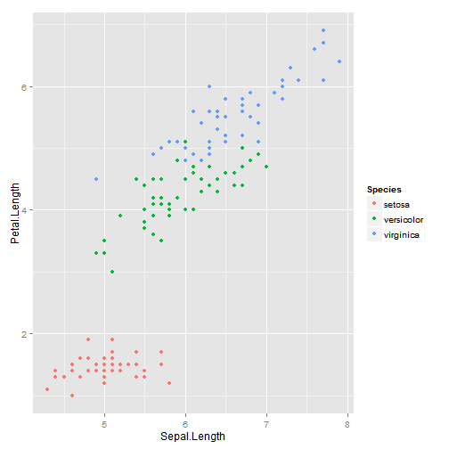 

Scatterplot
==========================================
class: small-code

```r
p <- ggplot(msleep, aes(x=bodywt, y=brainwt)) + geom_point()
```


```r
p
```


mtcars
================================================================


```r
# create factors with value labels 
mtcars$gear <- factor(mtcars$gear,levels=c(3,4,5),
    labels=c("3gears","4gears","5gears")) 

mtcars$am <- factor(mtcars$am,levels=c(0,1),
  	labels=c("Automatic","Manual")) 

mtcars$cyl <- factor(mtcars$cyl,levels=c(4,6,8),
   labels=c("4cyl","6cyl","8cyl")) 
```


plot 1
=============================================================


```r
# Kernel density plots for mpg
# grouped by number of gears (indicated by color)
p1 <- qplot(mpg, data=mtcars,
   geom="density", fill=gear, alpha=I(.5), 
   main="Distribution of Gas Milage", 
   xlab="Miles Per Gallon", 
   ylab="Density")
```

plot2
=============================================================


```r
p1
```

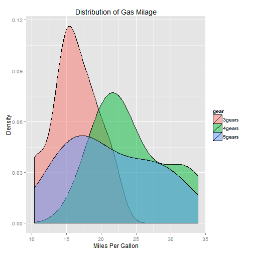 


=============================================================


```r
# Scatterplot of mpg vs. hp for each combination of gears and cylinders
# in each facet, transmittion type is represented by shape and color
p2 <- qplot(hp, mpg, data=mtcars, shape=am, color=am, 
   facets=gear~cyl, 
   size=I(3),
   xlab="Horsepower", 
   ylab="Miles per Gallon") 
```

=============================================================

```r
p2
```

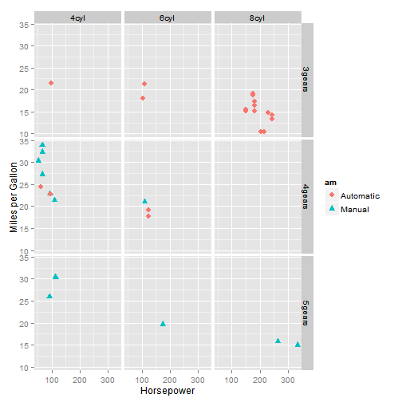 


=============================================================

```r
# Separate regressions of mpg on weight for each number of cylinders
p3 <- qplot(wt, mpg, data=mtcars, geom=c("point", "smooth"), 
   method="lm", formula=y~x, color=cyl, 
   main="Regression of MPG on Weight", 
   xlab="Weight", ylab="Miles per Gallon")
```


=============================================================

```r
p3
```

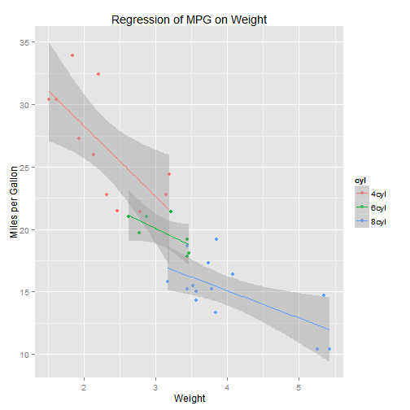 


=============================================================

```r
# Boxplots of mpg by number of gears 
# observations (points) are overlayed and jittered
p4 <- qplot(gear, mpg, data=mtcars, geom=c("boxplot", "jitter"), 
   fill=gear, main="Mileage by Gear Number",
   xlab="", ylab="Miles per Gallon")
```


=============================================================

```r
p4
```

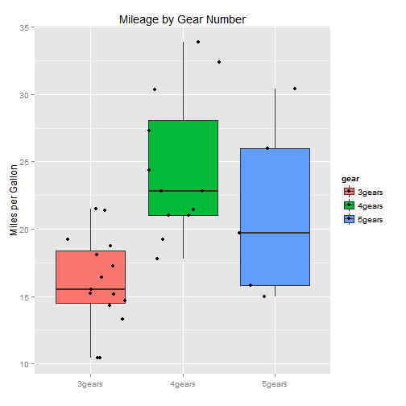 


Aesthetics & geoms
==========================================
class: small-code

```r
alt <- ggplot(msleep) + geom_point(aes(x=bodywt, y=brainwt))
```


```r
alt
```

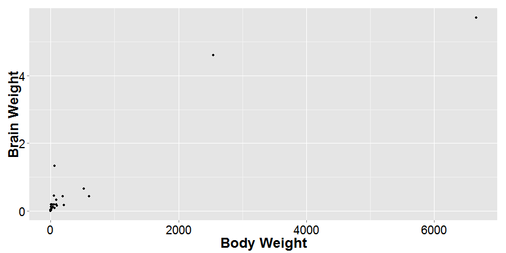

Axis scaling
===================================
class: small-code

```r
p <- p + scale_y_log10() + scale_x_log10()
```


```r
p
```

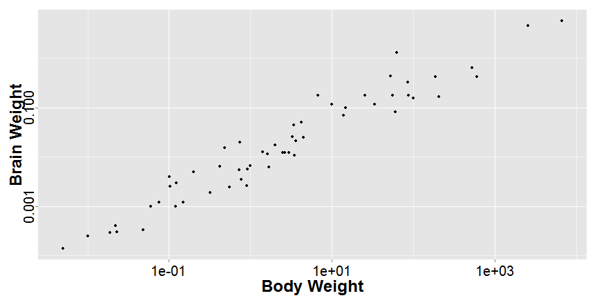

Classic theme
=============
class: small-code

```r
p <- p + theme_classic()
```


```r
p
```

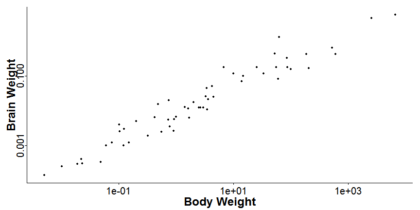
Smoothing
============
class: small-code

```r
p + stat_smooth()
```

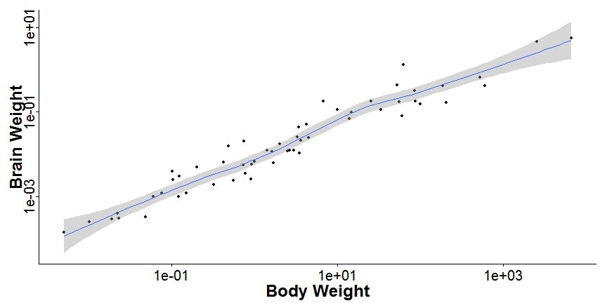

OLS regression line
====================
class: small-code

```r
p <- p + stat_smooth(method="lm")
p
```

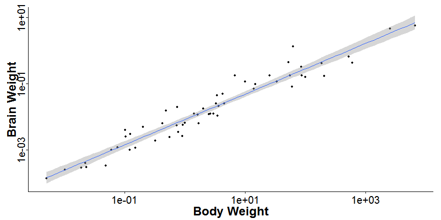

Faceting
=============
class: small-code

```r
p + facet_wrap(~vore)
```
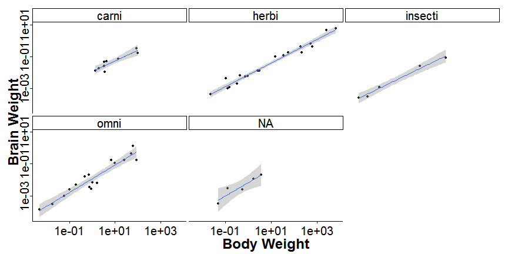

Color
======
class: small-code

```r
p + geom_point(aes(color=vore), size=3)
```
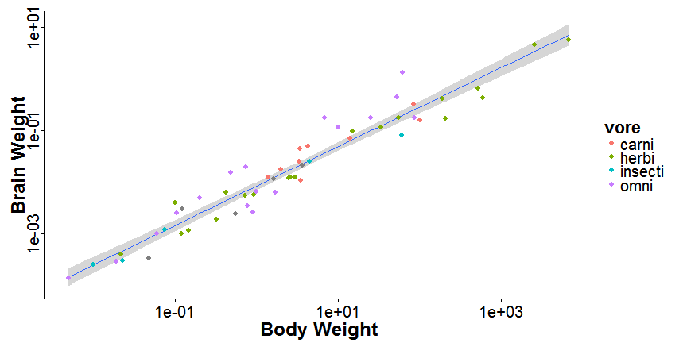

Line plots
==============
class: small-code

```r
data(co2)
lp <- ggplot(data.frame(co2), aes(x=1:length(co2), y=co2)) + geom_line()
```


```r
lp
```

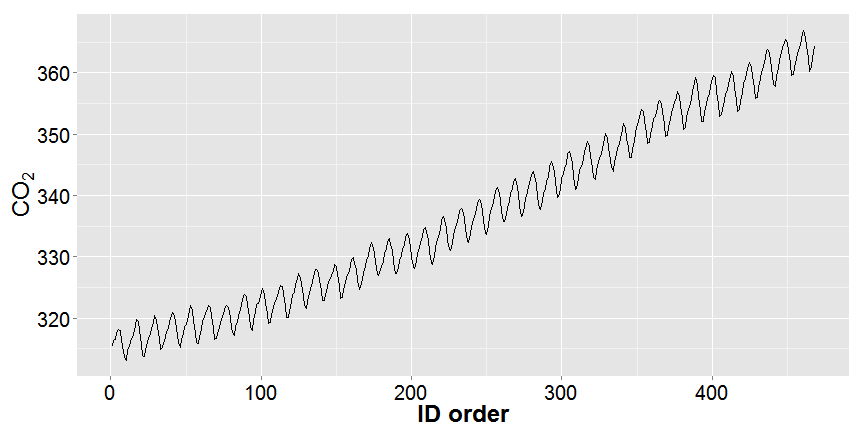

Box plots
=========
class: small-code

```r
bp <- ggplot(msleep, aes(x=conservation, y=awake)) + geom_boxplot()
```


```r
bp
```

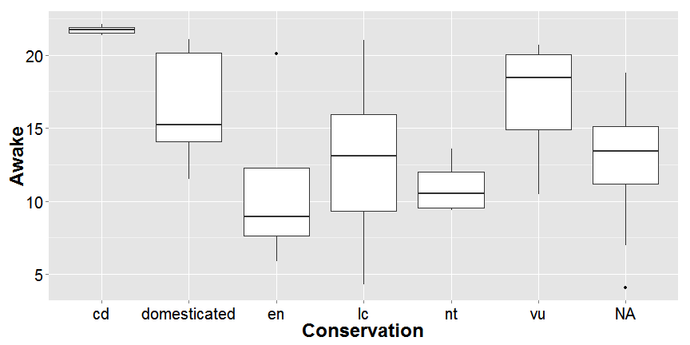

Dynamite plots
==============
Please don't.   


Dynamite plots
==============
class: small-code
First you have to create error bar parameters

```r
sumd <- aggregate(awake ~ conservation, data=msleep, FUN=mean)

sumd$sd <- aggregate(awake ~ conservation, data=msleep, FUN=sd)[,2]

limits <- aes(ymax = awake + sd, ymin = awake - sd)
```

Dynamite plots
==============
class: small-code

```r
dyp <- ggplot(sumd, aes(x=conservation, y=awake)) + geom_bar(fill="grey") + theme_classic()
```


```r
dyp
```

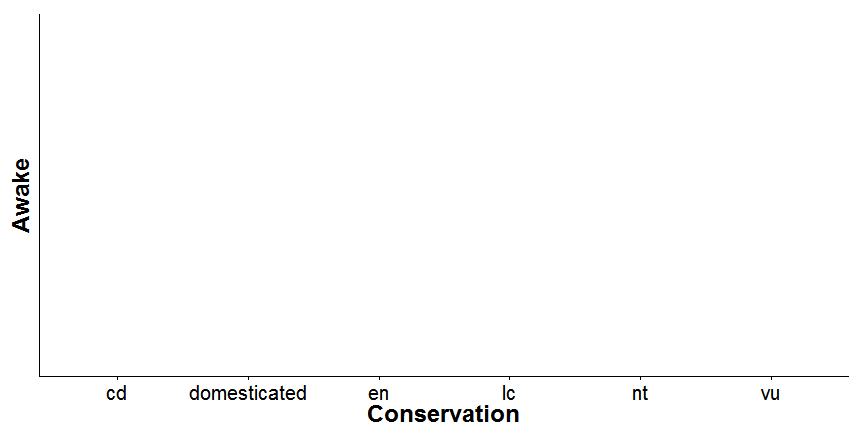
Dynamite plots
==============
class: small-code
Add your error bars

```r
dyp + geom_errorbar(limits, width=0.25)
```

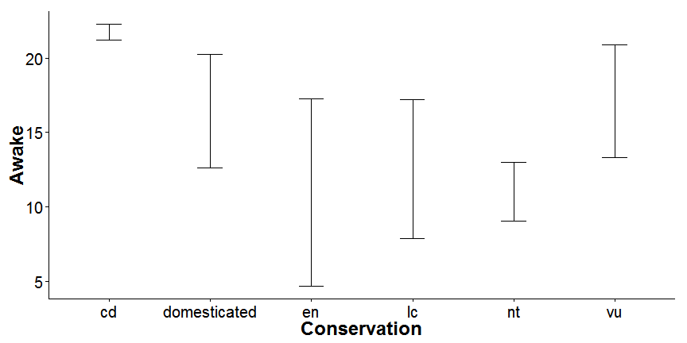

Combining plot types
====================
class: small-code


```
Error in eval(expr, envir, enclos) : 
  could not find function "grid.arrange"
```
