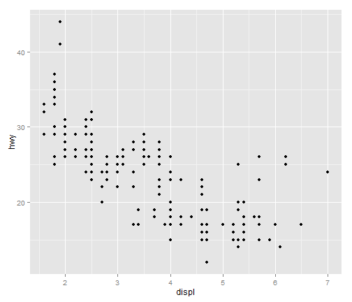
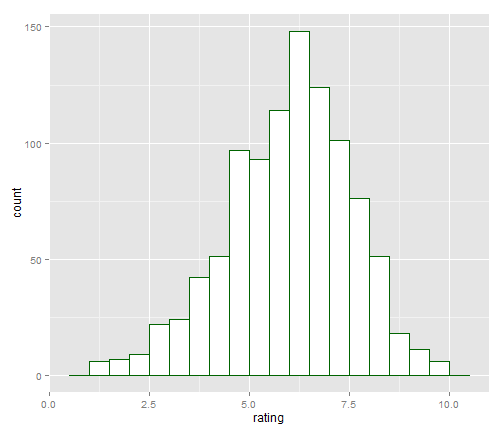
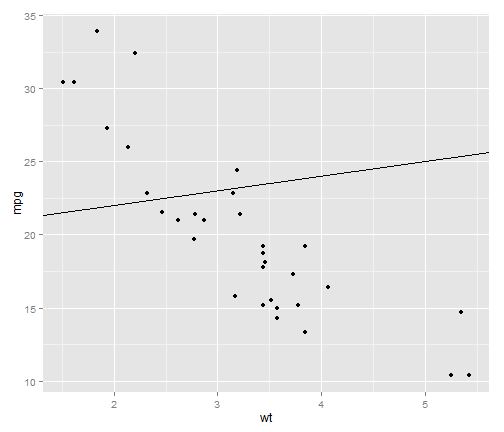

Facetting
====================
- One of the most useful techniques in data visualization is rendering groups of data alongside each other, making it easy to compare the groups. 
- With ggplot2, one way to do this is by mapping a discrete variable to an aesthetic, like x position, color, or shape.
- Another way of doing this is to create a subplot for each group and draw the subplots
side by side.
- **ggplot2** has two ways to do this: `facet_grid()` and `facet_wrap()`.

<hr>
### Facet Grid 
- With `facet_grid()`, you can specify a variable to split the data into vertical subpanels,
and another variable to split it into horizontal subpanels


```r
library(ggplot2)
# The base plot
p <- ggplot(mpg, aes(x = displ, y = hwy)) + geom_point()

# Faceted by drv, in vertically arranged subpanels
p + facet_grid(drv ~ .)
```

 

```r

# Faceted by cyl, in horizontally arranged subpanels
p + facet_grid(. ~ cyl)
```

 

```r

# Split by drv (vertical) and cyl (horizontal)
p + facet_grid(drv ~ cyl)
```

 

<hr>
### Facet Wraps
- `facet_wrap()` creates and labels a plot for every level of a factor which is passed to it. 
- Its primary argument takes the form of a one sided formula: `~Factor`. 
- It will then try to efficiently "wrap" these plots into a 2d grid.

```r
p + facet_wrap(~class)
```

 


```r
# These will have the same result: 2 rows and 4 cols
p + facet_wrap(~class, nrow = 2)
```

 

```r
p + facet_wrap(~class, ncol = 5)
```

 


<hr>
### Facet Scales

- Usually you will want all of your facets to have the same x and y scales. If you're plotting the same data in each facet, having free scales on each of the facets will ruin comparability across facets. 
- However, sometimes it will be appropriate to have free scales. You can do this by passing `scales = "free"` to `facet_wrap()`.


```r
p + facet_wrap(~class, scales = "free")
```

 


