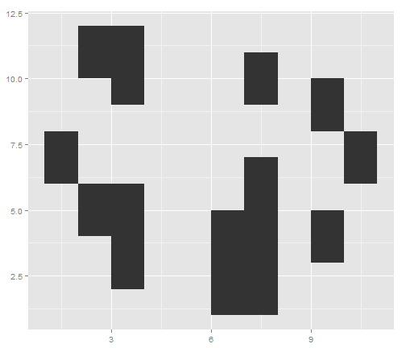
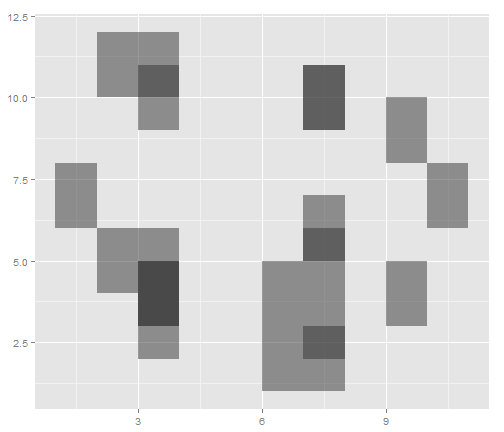

Overplotting
========================================================

viewer from accurately assessing the distribution of the data. This is called overplotting.
If the amount of overplotting is low, you may be able to alleviate it by using smaller
points, or by using a different shape (like shape 1, a hollow circle) through which other
points can be seen.

```r
library(ggplot2)
sp <- ggplot(diamonds, aes(x = carat, y = price))
sp + geom_point()
```

 


We can make the points semitransparent using alpha.
Here, we'll make them 90% transparent and then 99% transparent, by setting alpha=.1 and alpha=.01:


```r
sp + geom_point(alpha = 0.1)
```

 

```r
sp + geom_point(alpha = 0.01)
```

 


