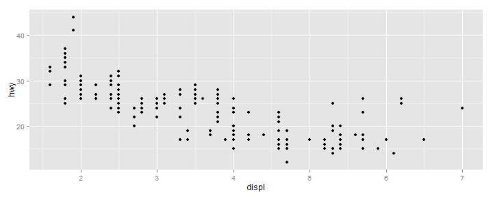

<style>
  p {     font-size:16px;
  }
</style>
What are Geoms?
==================

Geoms are the names for the types of shapes that represent the data on the chart, and there are two main types. 

The `geom_point` is an example of geom that works on individual data points, and so is straight forward to use as already 
shown. 

### geoms
`geom = "point"` draws points to produce a scatterplot. This is the default
when you supply both x and y arguments to `qplot()`.

`geom = "smooth"` fits a smoother to the data and displays the smooth and
its standard error.

`geom = "boxplot"` produces a box-and-whisker plot to summarise the
distribution of a set of points.

`geom = "path"` and `geom = "line"` draw lines between the data points.
Traditionally these are used to explore relationships between time and
another variable, but lines may be used to join observations connected in
some other way. A line plot is constrained to produce lines that travel from
left to right, while paths can go in any direction
<hr>
### Geom boxplots


However a collective geom such as `geom_boxplot` requires some collection of data to work on. So to produce a box plot,


```r
library(ggplot2)
p <- ggplot(iris, aes(Species, Sepal.Width))

# look at p (class, mode, str) before continuing
p + geom_boxplot()
```

 


This plot shows a box plot of the `Sepal.Width` for each species. Note that **ggplot2** has automatically divided the data into the correct categories as the x axis variable (`Species`) is discrete. Now it is also equally valid to produce a box plot with continuous variable (`Sepal.Length`) along the x axis.


```r
range(iris$Sepal.Length)
```

```
## [1] 4.3 7.9
```

```r
p <- ggplot(iris, aes(Sepal.Length, Sepal.Width))
p + geom_boxplot()
```

 

which if tried produces a single box plot using all the data, not particularly useful. However use of the group command results in something a bit more useful

```r
p <- ggplot(iris, aes(Sepal.Length, Sepal.Width))
p + geom_boxplot(aes(group = Species))
```

```
## Warning: position_dodge requires constant width: output may be incorrect
## Warning: position_dodge requires non-overlapping x intervals
```

 

Resultant Boxplot works - but is a bit weird. Lets try facetting


```r
p <- ggplot(iris, aes(Sepal.Length, Sepal.Width))
p + geom_boxplot(fill = c("lightblue")) + facet_wrap(~Species)
```

 


