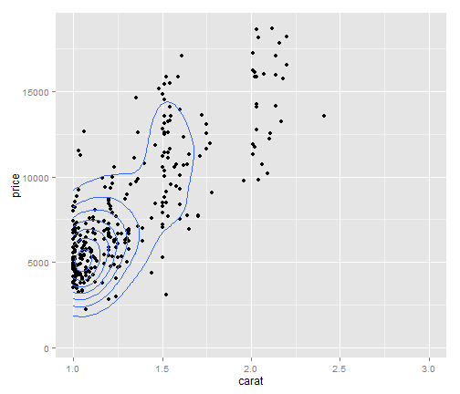
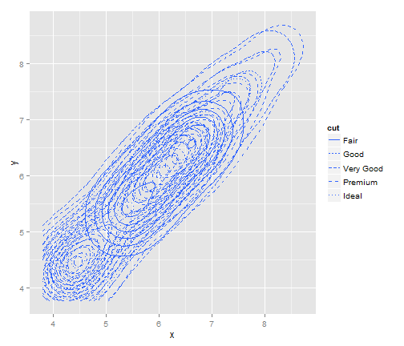

qplot with facetting
========================================================


```r
library(ggplot2)

qplot(mpg, wt, data = mtcars, geom = "point")
```

 


```r
table(mtcars$cyl, mtcars$gear)
```

```
##    
##      3  4  5
##   4  1  8  2
##   6  2  4  1
##   8 12  0  2
```


```r
# using facets (hint: bug in margins -> doesn't work)
qplot(mpg, wt, data = mtcars, facets = . ~ cyl, geom = "point")
```

 

```r
qplot(mpg, wt, data = mtcars, facets = gear ~ cyl, geom = "point")
```

 

```r
# facet_wrap / facet_grid
```


```r
# qplot(mpg, wt, data=mtcars, facets=~cyl, geom='point')
p.tmp <- ggplot(mtcars, aes(mpg, wt)) + geom_point()
```


```r
p.tmp + facet_wrap(~cyl)
```

 

```r
# qplot(mpg, wt, data=mtcars, facets=~cyl, geom='point')
p.tmp + facet_wrap(~cyl, ncol = 3)
```

 

```r
p.tmp + facet_grid(gear ~ cyl)
```

 

```r
p.tmp + facet_wrap(~cyl + gear)
```

 


```r
# controlling scales in facets (default: scales='fixed')
p.tmp + facet_wrap(~cyl, scales = "free")
```

 

```r
p.tmp + facet_wrap(~cyl, scales = "free_x")
```

 

```r
p.tmp + facet_wrap(~cyl, scales = "fixed")
```

 


```r
# contstraint on facet_grid (all rows,columns same scale)
p.tmp + facet_grid(gear ~ cyl, scales = "free_x")
```

 

```r
p.tmp + facet_grid(gear ~ cyl, scales = "free", space = "free")
```

 


