<style>
  p {     font-size:16px;
  }
</style>
qplot
========================================================

***qplot*** (short for quick plot) makes it easy to
produce complex plots, often requiring several lines of code using other plotting systems, in one line. 

***qplot()*** can do this because it's based on the grammar of graphics, which allows you to create a simple, yet expressive, description
of the plot.

***qplot()*** has been designed to be very similar to plot, which should make
it easy if you're already familiar with plotting in R. Remember, during an R
session you can get a summary of all the arguments to qplot with R help,
`?qplot`.

<hr>
### 1. Preliminaries
- Install package
- Inspect **mtcars** data set

```r
library(ggplot2)
# continuous scale vs. discrete scale
head(mtcars)
```

```
##                    mpg cyl disp  hp drat    wt  qsec vs am gear carb
## Mazda RX4         21.0   6  160 110 3.90 2.620 16.46  0  1    4    4
## Mazda RX4 Wag     21.0   6  160 110 3.90 2.875 17.02  0  1    4    4
## Datsun 710        22.8   4  108  93 3.85 2.320 18.61  1  1    4    1
## Hornet 4 Drive    21.4   6  258 110 3.08 3.215 19.44  1  0    3    1
## Hornet Sportabout 18.7   8  360 175 3.15 3.440 17.02  0  0    3    2
## Valiant           18.1   6  225 105 2.76 3.460 20.22  1  0    3    1
```

```r
names(mtcars)
```

```
##  [1] "mpg"  "cyl"  "disp" "hp"   "drat" "wt"   "qsec" "vs"   "am"   "gear"
## [11] "carb"
```

```r
table(mtcars$cyl)
```

```
## 
##  4  6  8 
## 11  7 14
```

```r
levels(mtcars$cyl)
```

```
## NULL
```


```r
qplot(wt, mpg, data = mtcars)
```

 

### Colour, size, shape and other aesthetic attributes

The first big difference when using qplot instead of plot comes when you
want to assign colours-or sizes or shapes-to the points on your plot. 

***qplot()*** makes it easy to include additional data on the plot.

#### Main Aesthetic Attributes
1. colour
2. size
3. shape


```r
qplot(wt, mpg, data = mtcars, colour = cyl)
```

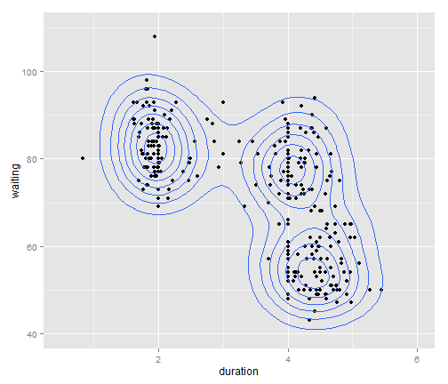 


```r
# Specifying cyl as a factor
qplot(wt, mpg, data = mtcars, colour = factor(cyl))
```

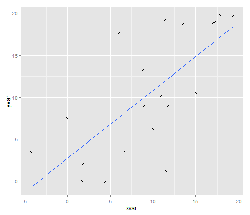 

### Use Different "aesthetic"" mappings size and shape


```r
qplot(wt, mpg, data = mtcars, shape = factor(cyl))
```

 

```r
qplot(wt, mpg, data = mtcars, size = qsec)
```

 


### Combine mappings

```r

# (hint: hollow points, geom-concept, legend combination)
qplot(wt, mpg, data = mtcars, size = qsec, color = factor(carb))
```

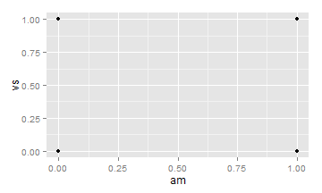 

### Plot Characters

```r
# Default pch (pch = 1) and pch = 17
qplot(wt, mpg, data = mtcars, size = qsec, color = factor(carb), shape = I(1))
```

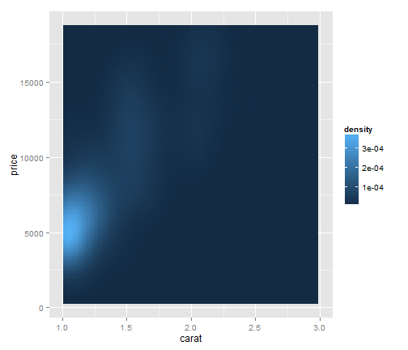 

```r
qplot(wt, mpg, data = mtcars, size = qsec, color = factor(carb), shape = I(17))
```

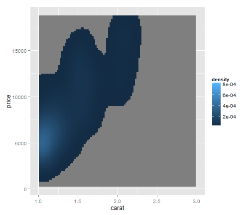 

Remark : `I()` inhibits interpretation/conversion of objects

### Scatterplot


```r
qp1 <- qplot(wt, mpg, data = mtcars, size = qsec, shape = factor(cyl))
class(qp1)
```

```
## [1] "gg"     "ggplot"
```

```r
qp1
```

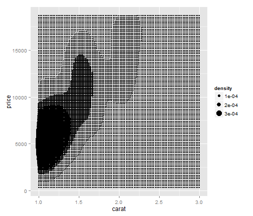 


Explicitly use `geom_point` - the reason will become clear shortly.

```r

qplot(wt, mpg, data = mtcars, size = qsec, shape = factor(cyl), geom = "point")
```

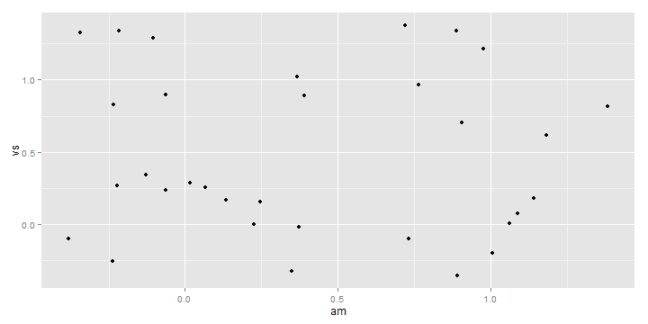 

```r
qplot(wt, mpg, data = mtcars, size = factor(cyl), geom = "point")
```

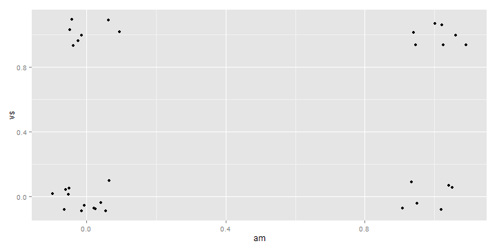 


### Enhancing plots


```r
# bar-plot
qplot(factor(cyl), data = mtcars, geom = "bar")
```

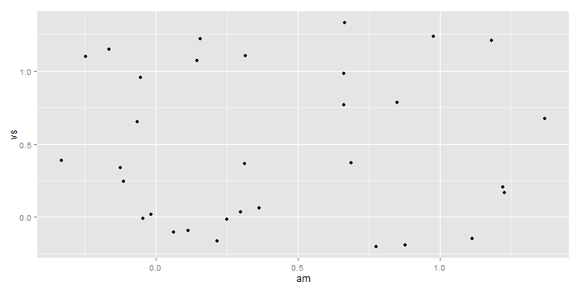 

```r
# flip plot by 90°
qplot(factor(cyl), data = mtcars, geom = "bar") + coord_flip()
```

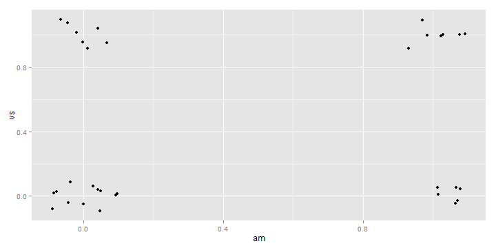 


### Difference between fill/color bars

```r
# difference between fill/color bars
qplot(factor(cyl), data = mtcars, geom = "bar", fill = factor(cyl))
```

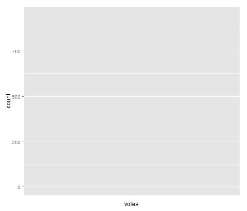 

```r
qplot(factor(cyl), data = mtcars, geom = "bar", colour = factor(cyl))
```

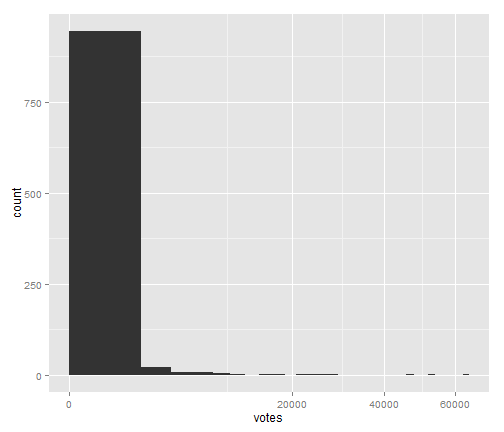 


```r

# fill by variable
qplot(factor(cyl), data = mtcars, geom = "bar", fill = factor(gear))
```

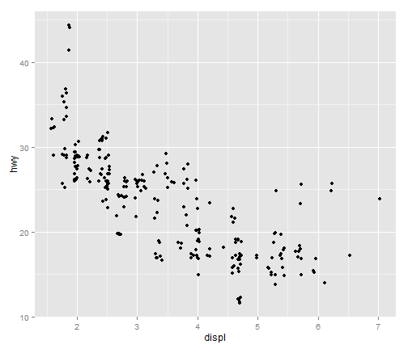 

```r
# use different display of bars (stacked, dodged, identity)
head(diamonds)
```

```
##   carat       cut color clarity depth table price    x    y    z
## 1  0.23     Ideal     E     SI2  61.5    55   326 3.95 3.98 2.43
## 2  0.21   Premium     E     SI1  59.8    61   326 3.89 3.84 2.31
## 3  0.23      Good     E     VS1  56.9    65   327 4.05 4.07 2.31
## 4  0.29   Premium     I     VS2  62.4    58   334 4.20 4.23 2.63
## 5  0.31      Good     J     SI2  63.3    58   335 4.34 4.35 2.75
## 6  0.24 Very Good     J    VVS2  62.8    57   336 3.94 3.96 2.48
```


### Types of Bar Plots

```r
qplot(clarity, data = diamonds, geom = "bar", fill = cut, position = "stack")
```

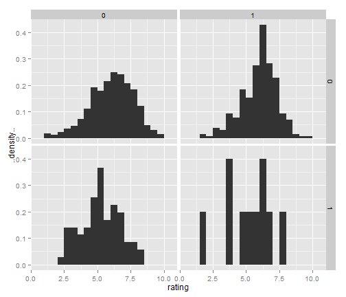 

```r
qplot(clarity, data = diamonds, geom = "bar", fill = cut, position = "dodge")
```

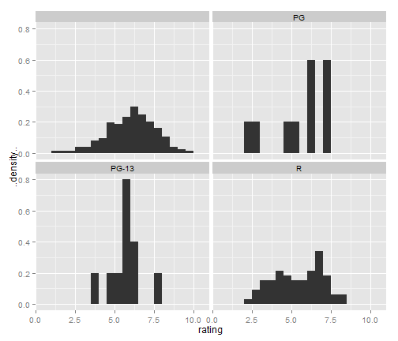 

```r
qplot(clarity, data = diamonds, geom = "bar", fill = cut, position = "fill")
```

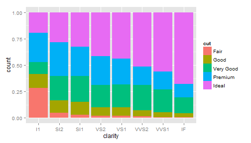 

```r
qplot(clarity, data = diamonds, geom = "bar", fill = cut, position = "identity")
```

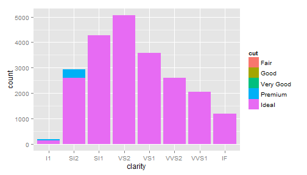 


### Frequency Polygon


```r
qplot(clarity, data = diamonds, geom = "freqpoly", group = cut, colour = cut, 
    position = "identity")
```

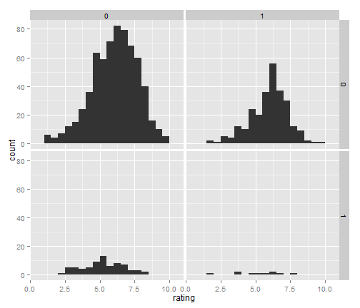 


```r
qplot(clarity, data = diamonds, geom = "freqpoly", group = cut, colour = cut, 
    position = "stack")
```

```
## ymax not defined: adjusting position using y instead
```

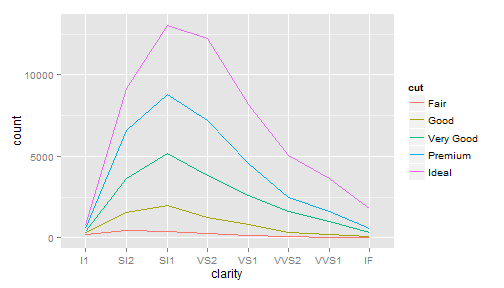 


### Histograms


```r
# histogram
qplot(carat, data = diamonds, geom = "histogram")
```

```
## stat_bin: binwidth defaulted to range/30. Use 'binwidth = x' to adjust this.
```

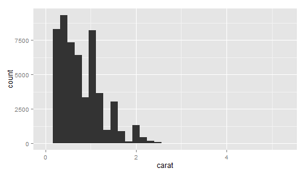 


```r
# change binwidth
qplot(carat, data = diamonds, geom = "histogram", binwidth = 0.1)
```

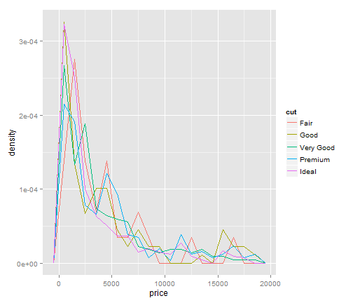 

```r
qplot(carat, data = diamonds, geom = "histogram", binwidth = 0.01)
```

```
## Warning: position_stack requires constant width: output may be incorrect
```

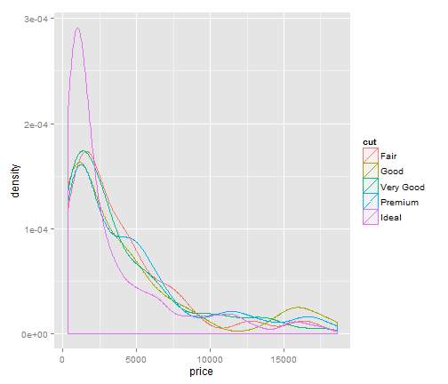 

### Density Plot

```r
qplot(carat, data = diamonds, geom = "density", colour = color)
```

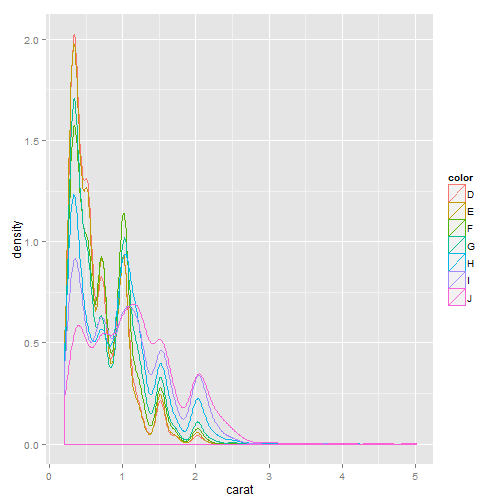 

```r
qplot(carat, data = diamonds, geom = "histogram", fill = color)
```

```
## stat_bin: binwidth defaulted to range/30. Use 'binwidth = x' to adjust this.
```

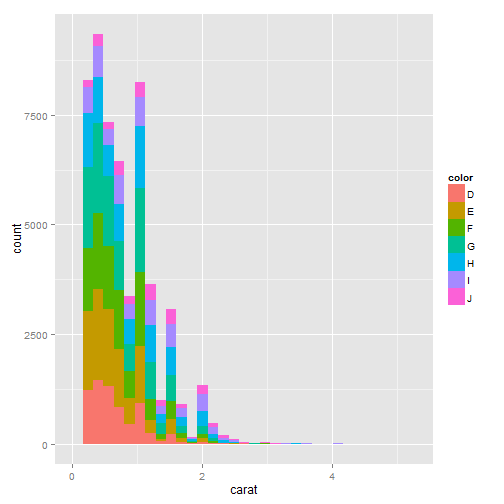 


```r
# use geom to combine plots (hint: order of layers)
qplot(wt, mpg, data = mtcars, geom = c("point", "smooth"))
```

```
## geom_smooth: method="auto" and size of largest group is <1000, so using loess. Use 'method = x' to change the smoothing method.
```

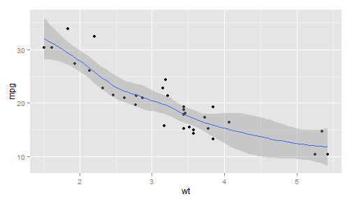 

```r
qplot(wt, mpg, data = mtcars, geom = c("smooth", "point"))
```

```
## geom_smooth: method="auto" and size of largest group is <1000, so using loess. Use 'method = x' to change the smoothing method.
```

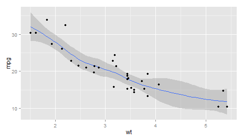 

```r
qplot(wt, mpg, data = mtcars, color = factor(cyl), geom = c("point", "smooth"))
```

```
## geom_smooth: method="auto" and size of largest group is <1000, so using loess. Use 'method = x' to change the smoothing method.
```

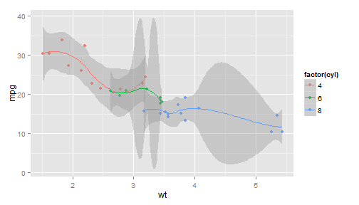 


