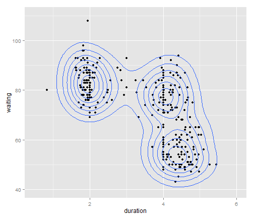
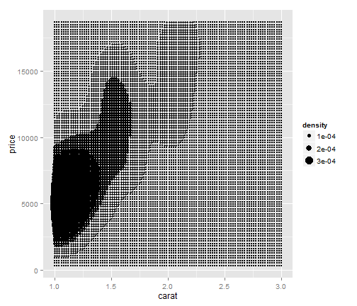
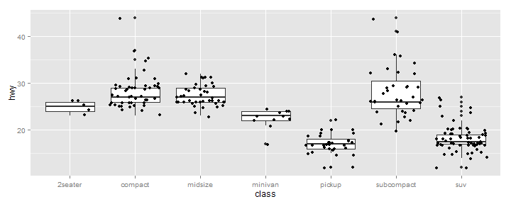
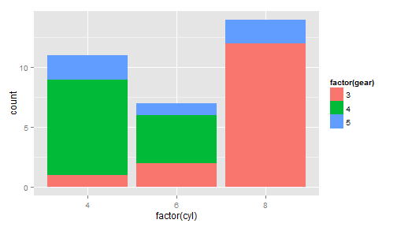

Stats
=======================
### Displaying Statistics
You'll frequently want to add statistical analyses to your plots, or your plots may just be of statistical summaries anyway. **ggplot2** has a few built in statistics to make plotting easier.

A frequently used statistic is a smoothing line with `stat_smooth()`. There are a number of different smoothing lines you can add, from local regression lines (loess) to linear or logistic regressions. 

Let's start with the mpg data again.

```r
library(ggplot2)
p <- ggplot(mpg, aes(displ, hwy))

p + geom_point() + stat_smooth()
```

```
## geom_smooth: method="auto" and size of largest group is <1000, so using loess. Use 'method = x' to change the smoothing method.
```

 

By default, `stat_smooth()` has added a loess line with the standard error represented by a semi-transparent ribbon. You could also specify the method to use to add a different smoothing line.

```r
p + geom_point() + stat_smooth(method = "lm")
```

 


```r
library(MASS)
p + geom_point() + stat_smooth(method = "rlm")
```

 

Now, statistics are represented with default geometries. 
For `stat_smooth()`, its default geoms are `geom_ribbon() + geom_smooth()`. You could also (inadvisedly) represent the output of the smoothing function with points and errorbars.

```r
# No a good plot
p + stat_smooth(geom = "point") + stat_smooth(geom = "errorbar")
```

```
## geom_smooth: method="auto" and size of largest group is <1000, so using loess. Use 'method = x' to change the smoothing method.
## geom_smooth: method="auto" and size of largest group is <1000, so using loess. Use 'method = x' to change the smoothing method.
```

 

<hr>

- *http://sharpstatistics.co.uk/r/ggplot2-guide/*


- Stats apply statistical transformations that are used to summarise the data, and allows a huge range of possibilities. 

- `Stat_smooth` is a useful stat to illustrate the principles, which fits a line and a shaded band to indicate some specified level of uncertainty, as shown in the following example which fits a linear regression line.


```r

ggplot(iris, aes(Sepal.Length, Sepal.Width)) + geom_point() + stat_smooth(method = "lm")
```

 

- Stats are automatically split according to the factors so produces a plot with 3 sets of fitted lines on which could be considered a little confusing. 


```r
ggplot(iris, aes(Sepal.Length, Sepal.Width, color = factor(Species))) + geom_point() + 
    stat_smooth(method = "lm")
```

 

- As faceting is similar to using factors the stat is also automatically split over the plots as shown below.


```r
p <- ggplot(iris, aes(Sepal.Length, Sepal.Width)) + geom_point()
p + facet_grid(. ~ Species) + stat_smooth(method = "lm")
```

 


There are various options for the model, which again is listed in the notes on the Ggplot2 website. For example if you want a quadratic model, use the standard R notation. Note that the variables are referred to as x and y not by name.

```r
stat_smooth(method = "lm", formula = y ~ I(x^2))
```

```
## geom_smooth:  
## stat_smooth: method = lm, formula = y ~ I(x^2), se = TRUE, n = 80, fullrange = FALSE, level = 0.95, na.rm = FALSE 
## position_identity: (width = NULL, height = NULL)
```

- As the stat is just another layer on the plot the original geom can be omitted if required just to show the stat.

```r
ggplot(iris, aes(Sepal.Length, Sepal.Width, color = factor(Species))) + stat_smooth(method = "lm")
```

 

### stat_summary
A very flexible stat is the `stat_summary` function which allows definition of custom summary statistics. As an example to produce a bar chart of the mean value of Sepal width for each species of iris.

```r
mean(iris$Sepal.Width)
```

```
## [1] 3.057
```

```r
ggplot(iris, aes(Species, Sepal.Width)) + stat_summary(fun.y = mean, geom = "bar")
```

 

which works as mean takes a vector and returns as single value that defines the y value for each bar. 
- `stat_summary` can also take 2 other values `ymin` and `ymax` which define the upper and lower bounds.
- The following function shows how to specify your own summaries. 
- Define a function that takes a vector and returns the mean plus and minus 1 standard deviation, and names the two results as `ymin` and `ymax`.


```r
myFunc = function(x) {
    result = c(mean(x) - sd(x), mean(x) + sd(x))
    names(result) = c("ymin", "ymax")
    result
}
```

then pass this function into `stat_summary`
and the result is used to define the limits for ***error bars***.

```r
p <- ggplot(iris, aes(Species, Sepal.Length))
p + stat_summary(fun.y = mean, geom = "point", color = "red", size = 5) + stat_summary(fun.data = "myFunc", 
    geom = "errorbar", width = 0.2)
```

 

