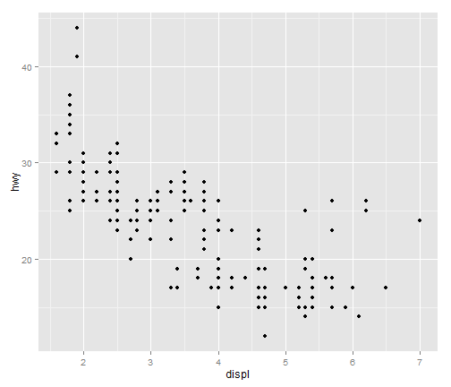
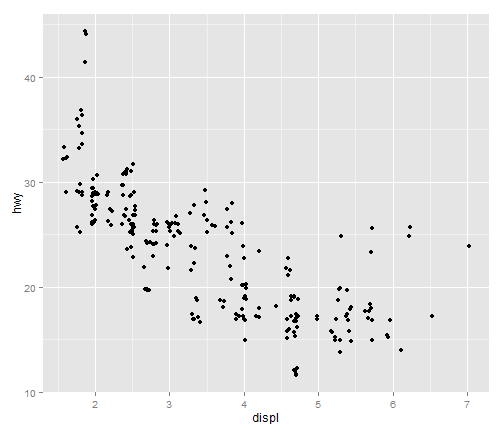
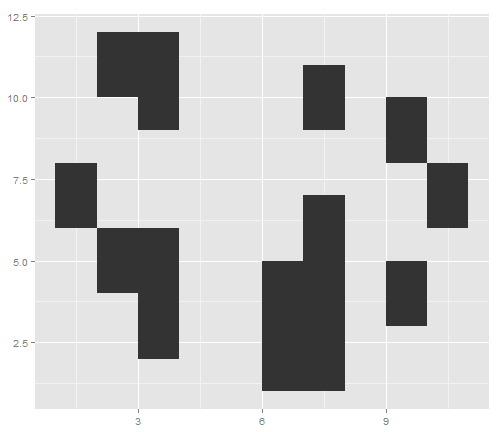

Geoms - Frequency Polygons
========================================================


```r
library(ggplot2)
qplot(clarity, data = diamonds, geom = "freqpoly", group = cut, colour = cut, 
    position = "identity")
```

 

```r

qplot(clarity, data = diamonds, geom = "freqpoly", group = cut, colour = cut, 
    position = "stack")
```

```
## ymax not defined: adjusting position using y instead
```

 


You can also embed plots, for example:


```r
plot(cars)
```

 


