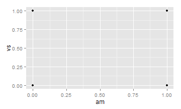

Scatterplots
========================================================

### 1. Preliminaries
- load **ggplot2**
- Inspect the ***iris*** data set

```r
library(ggplot2)
dim(iris)
```

```
## [1] 150   5
```

```r
names(iris)
```

```
## [1] "Sepal.Length" "Sepal.Width"  "Petal.Length" "Petal.Width" 
## [5] "Species"
```

```r
class(iris)
```

```
## [1] "data.frame"
```

```r
table(iris$Species)
```

```
## 
##     setosa versicolor  virginica 
##         50         50         50
```


### 2. Scatterplots
- Basic scatterplot - Use `geom_point()`, and map one variable to x and one to y.

```r
# plot(iris$Sepal.Length,iris$Petal.Width)
ggplot(iris, aes(x = Sepal.Length, y = Petal.Width)) + geom_point()
```

 

#### 2.1 Changing Plot Character
- Change the plot character to triangle (number 17).
- Change the colour to red.
- Increase size to 3. (The default value of `size` is 2, whereas default for `cex` is 1.)

```r
# plot(iris$Sepal.Length,iris$Petal.Width, pch=17,col='red', cex=1.5)
ggplot(iris, aes(x = Sepal.Length, y = Petal.Width)) + geom_point(shape = 17, 
    col = "red", size = 3)
```

 


### 3. Grouping Data Points by a Variable Using Shape or Colour.
We can group points on the variable `Species` by mapping specied to one of the aesthetics 
- colour
- shape 

```r
# ggplot(iris, aes(x=Sepal.Length, y=Sepal.Width))
ggplot(iris, aes(x = Sepal.Length, y = Sepal.Width, colour = Species)) + geom_point(size = 3)
```

 

```r
ggplot(iris, aes(x = Sepal.Length, y = Sepal.Width, shape = Species)) + geom_point(size = 3)
```

 


Both of these approaches can be used in tandem. Lets use a data set with multiple categorical variables (***diamonds*** and ***tips*** data sets in the **ggplot2** and ***reshape2*** package respectively). The outcome is a bit hard to read.


```r
ggplot(diamonds, aes(x = price, y = log(z), colour = clarity)) + geom_point(size = 3)
```

 

```r

ggplot(diamonds, aes(x = price, y = log(z), colour = clarity, shape = cut)) + 
    geom_point(size = 3)
```

 


Easier to look at.


```r
library(reshape2)
ggplot(tips, aes(x = total_bill, y = tip, colour = day, shape = smoker)) + geom_point(size = 3)
```

 

```r

```

The default shapes and colors may not be very appealing. 
`scale_manual` expressions allow you to Create your own discrete scale.
Other shapes can be used with `scale_shape_manual()`, and other colours can be used with `scale_colour_brewer()` or `scale_colour_manual()`.

