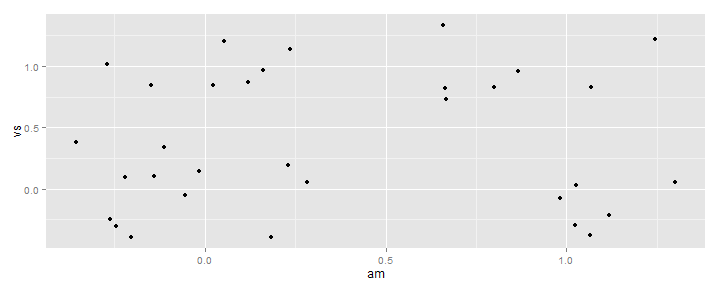
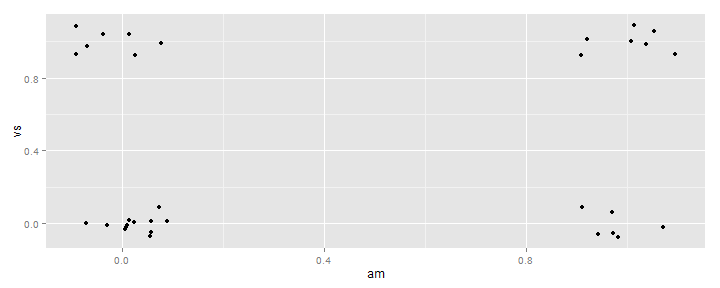
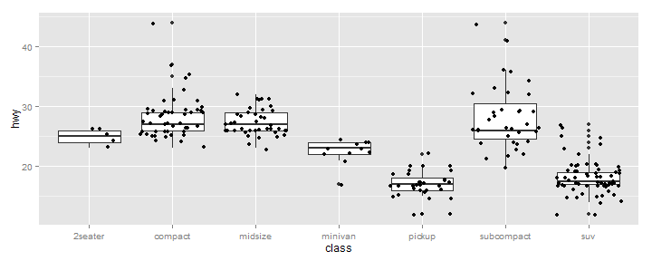

Summarized Data Distributions
========================================================

Chapter 6 of ***R Graphics cookbook*** by Winston Chang

### 1. Preliminaries
- Load packages **ggplot2** and **MASS**
- Prepare Data Sets **faithful**(base) and **birthwt**(MASS)


```r
# Preliminaries
library(ggplot2)
library(MASS)  # Birth Weight data set

# Make a copy of the data
birthwt1 <- birthwt
# Convert smoke to a factor
birthwt1$smoke <- factor(birthwt1$smoke)
```


#### 1.1 Old Faithful Data Set
Description: Waiting time between eruptions and the duration of the eruption for the Old Faithful geyser in Yellowstone National Park, Wyoming, USA.

- `eruptions` (numeric)	Eruption time in mins
- `waiting` (numeric)  Waiting time to next eruption (in mins)


```r
dim(faithful)
```

```
## [1] 272   2
```

```r
head(faithful)
```

```
##   eruptions waiting
## 1     3.600      79
## 2     1.800      54
## 3     3.333      74
## 4     2.283      62
## 5     4.533      85
## 6     2.883      55
```


#### 1.2 Birthweight Data Set

```r
dim(birthwt1)
```

```
## [1] 189  10
```

```r
head(birthwt1)
```

```
##    low age lwt race smoke ptl ht ui ftv  bwt
## 85   0  19 182    2     0   0  0  1   0 2523
## 86   0  33 155    3     0   0  0  0   3 2551
## 87   0  20 105    1     1   0  0  0   1 2557
## 88   0  21 108    1     1   0  0  1   2 2594
## 89   0  18 107    1     1   0  0  1   0 2600
## 91   0  21 124    3     0   0  0  0   0 2622
```

<hr>
### 2. Making a Basic Histogram
***Example 6.1***

```r
ggplot(faithful, aes(x = waiting)) + geom_histogram()
```

```
## stat_bin: binwidth defaulted to range/30. Use 'binwidth = x' to adjust this.
```

 


#### 2.1 Adjusting binwidth
We will focus on an overview of the geoms in general, but this warning message indicated that these can take additional arguments. Let's change the binwidth to 3.

```r
ggplot(faithful, aes(x = waiting)) + geom_histogram(binwidth = 3)
```

 

<hr>

### 3. Making a Density Curve
***Example 6.3***
- use of `geom_density()`

```r
ggplot(faithful, aes(x = waiting)) + geom_density()
```

 

<hr>


```r
ggplot(faithful, aes(x = waiting)) + geom_line(stat = "density", adjust = 0.25, 
    colour = "red") + geom_line(stat = "density") + geom_line(stat = "density", 
    adjust = 2, colour = "blue")
```

 

<hr>
### 4. Making Multiple Density Curves from Grouped Data
***Example 6.5***

```r

# Map smoke to colour
ggplot(birthwt1, aes(x = bwt, colour = smoke)) + geom_density()
```

 

```r
# Map smoke to fill and make the fill semitransparent by setting alpha
ggplot(birthwt1, aes(x = bwt, fill = smoke)) + geom_density(alpha = 0.3)
```

 


<hr>
### 5. Making a Frequency Polygon
***Example 6.6***

- use of `geom_freqpoly()`


```r
ggplot(faithful, aes(x = waiting)) + geom_freqpoly()
```

```
## stat_bin: binwidth defaulted to range/30. Use 'binwidth = x' to adjust this.
```

 

