`geom_boxplot`
========================================================


```r
library(ggplot2)
p <- ggplot(mtcars, aes(factor(cyl), mpg))

p + geom_boxplot()
```

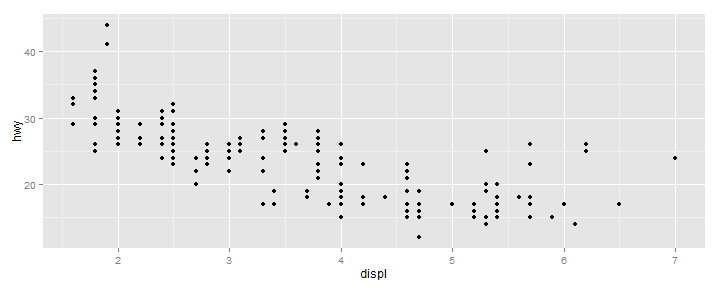 

### Using Quickplot

```r
qplot(factor(cyl), mpg, data = mtcars, geom = "boxplot")
```

 

### `jitter` and `coord_flip`

```r
p + geom_boxplot() + geom_jitter()
```

 

```r
p + geom_boxplot() + coord_flip()
```

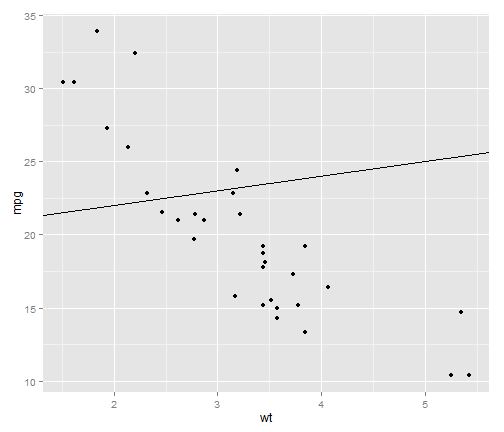 

```r
# Quickplot Variant
qplot(factor(cyl), mpg, data = mtcars, geom = "boxplot") + coord_flip()
```

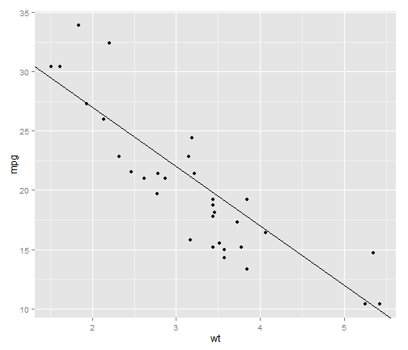 

### Notched Boxplots

```r
p + geom_boxplot(notch = TRUE)
```

```
## notch went outside hinges. Try setting notch=FALSE.
## notch went outside hinges. Try setting notch=FALSE.
```

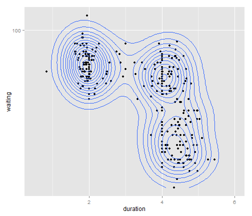 

```r
p + geom_boxplot(notch = TRUE, notchwidth = 0.3)
```

```
## notch went outside hinges. Try setting notch=FALSE.
## notch went outside hinges. Try setting notch=FALSE.
```

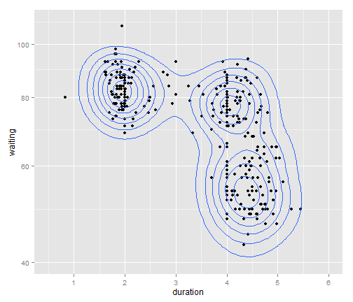 

```r

p + geom_boxplot(outlier.colour = "green", outlier.size = 3)
```

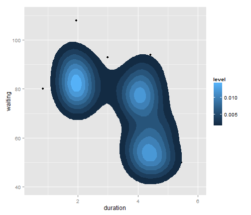 

### Adding aesthetic mappings
Note that boxplots are automatically dodged when any aesthetic is
a factor.

```r

p + geom_boxplot(aes(fill = cyl))
```

 

```r
p + geom_boxplot(aes(fill = factor(cyl)))
```

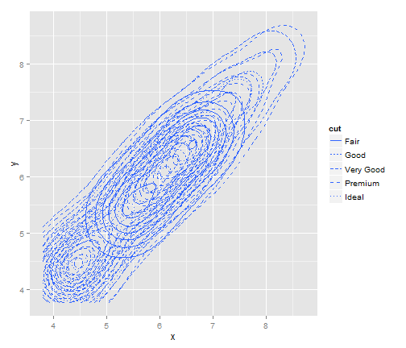 

```r
p + geom_boxplot(aes(fill = factor(vs)))
```

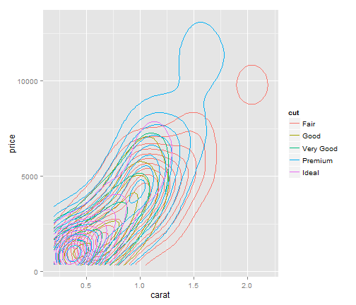 

```r
p + geom_boxplot(aes(fill = factor(am)))
```

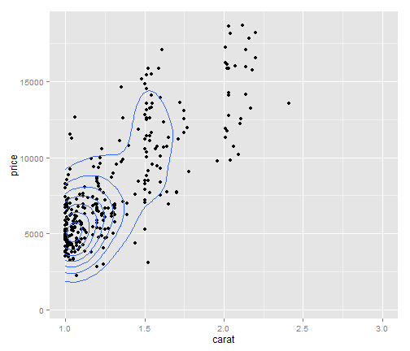 


### Set aesthetics to fixed value

```r
p + geom_boxplot(fill = "grey80", colour = "#3366FF")
```

 

```r
qplot(factor(cyl), mpg, data = mtcars, geom = "boxplot", colour = I("#3366FF"))
```

 

```r

# Scales vs. coordinate transforms ------- Scale transformations occur
# before the boxplot statistics are computed.  Coordinate transformations
# occur afterwards.  Observe the effect on the number of outliers.
library(plyr)  # to access round_any
m <- ggplot(movies, aes(y = votes, x = rating, group = round_any(rating, 0.5)))
m + geom_boxplot()
```

```
## Warning: position_dodge requires constant width: output may be incorrect
```

 

```r
m + geom_boxplot() + scale_y_log10()
```

```
## Warning: position_dodge requires constant width: output may be incorrect
```

 

```r
m + geom_boxplot() + coord_trans(y = "log10")
```

```
## Warning: position_dodge requires constant width: output may be incorrect
```

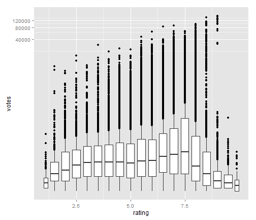 

```r
m + geom_boxplot() + scale_y_log10() + coord_trans(y = "log10")
```

```
## Warning: position_dodge requires constant width: output may be incorrect
```

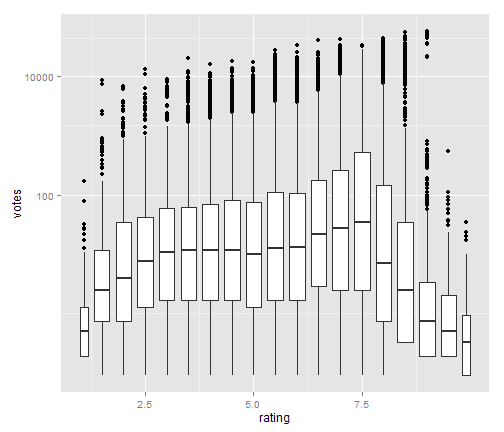 

```r

# Boxplots with continuous x: Use the group aesthetic to group observations
# in boxplots
qplot(year, budget, data = movies, geom = "boxplot")
```

```
## Warning: Removed 53573 rows containing non-finite values (stat_boxplot).
```

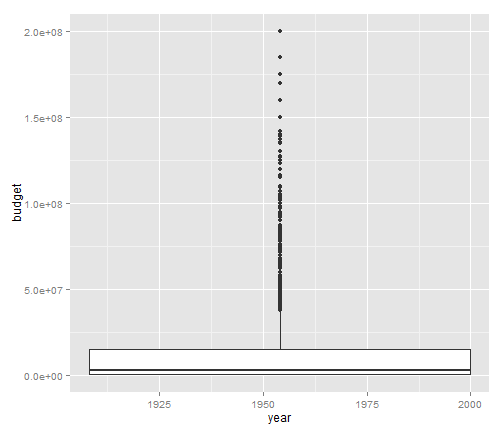 

```r
qplot(year, budget, data = movies, geom = "boxplot", group = round_any(year, 
    10, floor))
```

```
## Warning: Removed 53573 rows containing non-finite values (stat_boxplot).
## Warning: position_dodge requires constant width: output may be incorrect
```

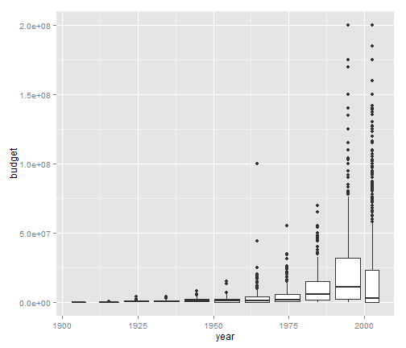 

```r

# Using precomputed statistics generate sample data
abc <- adply(matrix(rnorm(100), ncol = 5), 2, quantile, c(0, 0.25, 0.5, 0.75, 
    1))
b <- ggplot(abc, aes(x = X1, ymin = `0%`, lower = `25%`, middle = `50%`, upper = `75%`, 
    ymax = `100%`))
b + geom_boxplot(stat = "identity")
```

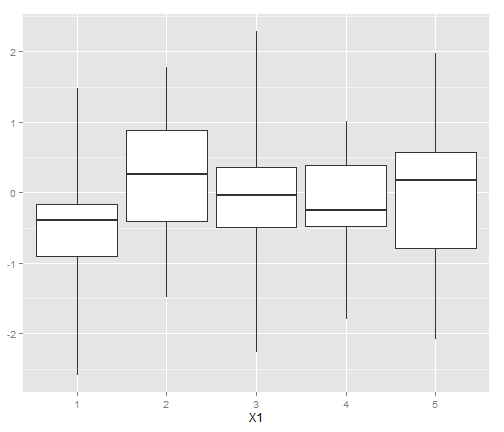 

```r
b + geom_boxplot(stat = "identity") + coord_flip()
```

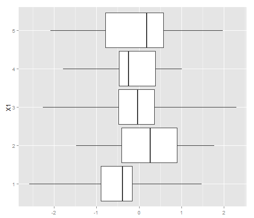 

```r
b + geom_boxplot(aes(fill = X1), stat = "identity")
```

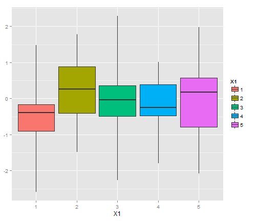 


