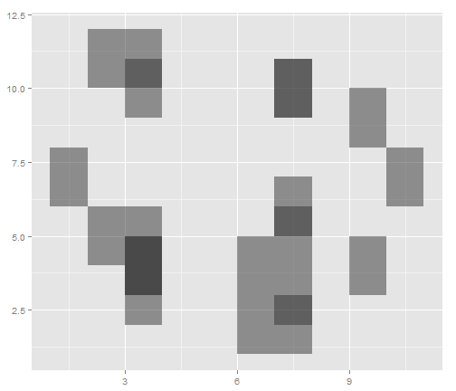
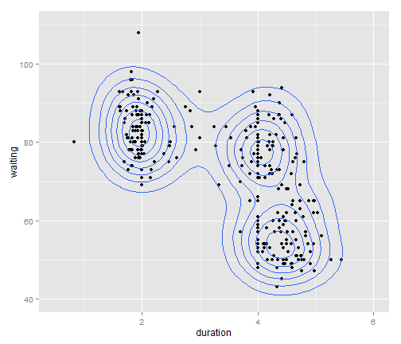
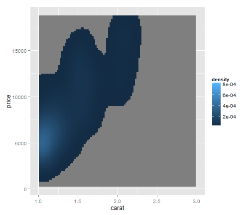

`geom_density2d` and `stat_density2d`
========================================================

### Preliminaries


```r
library(ggplot2)
library(MASS)
data(geyser)
head(geyser)
```

```
##   waiting duration
## 1      80    4.017
## 2      71    2.150
## 3      57    4.000
## 4      80    4.000
## 5      75    4.000
## 6      77    2.000
```


```r

m <- ggplot(geyser, aes(x = duration, y = waiting)) + geom_point() + xlim(0.5, 
    6) + ylim(40, 110)
m
```

 

```r
# Add contours
m + geom_density2d()
```

 


```r
dens <- kde2d(geyser$duration, geyser$waiting, n = 50, lims = c(0.5, 6, 40, 
    110))
densdf <- data.frame(expand.grid(duration = dens$x, waiting = dens$y), z = as.vector(dens$z))
head(densdf)
```

```
##   duration waiting         z
## 1   0.5000      40 1.125e-15
## 2   0.6122      40 3.268e-15
## 3   0.7245      40 8.743e-15
## 4   0.8367      40 2.154e-14
## 5   0.9490      40 4.890e-14
## 6   1.0612      40 1.023e-13
```

```r
m + geom_contour(aes(z = z), data = densdf)
```

 


```r
m + geom_density2d() + scale_y_log10()
```

```
## Scale for 'y' is already present. Adding another scale for 'y', which will replace the existing scale.
```

 

```r
m + geom_density2d() + coord_trans(y = "log10")
```

 

```r

m + stat_density2d(aes(fill = ..level..), geom = "polygon")
```

 


```r
qplot(duration, waiting, data = geyser, geom = c("point", "density2d")) + xlim(0.5, 
    6) + ylim(40, 110)
```

 


### Diamonds Data Set

If you map an aesthetic to a categorical variable, you will get a
set of contours for each value of that variable


```r
set.seed(4393)
dsmall <- diamonds[sample(nrow(diamonds), 1000), ]
qplot(x, y, data = dsmall, geom = "density2d", colour = cut)
```

 

```r
qplot(x, y, data = dsmall, geom = "density2d", linetype = cut)
```

 

```r
qplot(carat, price, data = dsmall, geom = "density2d", colour = cut)
```

 

```r
d <- ggplot(dsmall, aes(carat, price)) + xlim(1, 3)
d + geom_point() + geom_density2d()
```

```
## Warning: Removed 684 rows containing non-finite values (stat_density2d).
## Warning: Removed 684 rows containing missing values (geom_point).
```

 

If we turn contouring off, we can use use geoms like tiles:


```r
d + stat_density2d(geom = "tile", aes(fill = ..density..), contour = FALSE)
```

```
## Warning: Removed 684 rows containing non-finite values (stat_density2d).
```

 

```r
last_plot() + scale_fill_gradient(limits = c(1e-05, 8e-04))
```

```
## Warning: Removed 684 rows containing non-finite values (stat_density2d).
```

 


```r
# Or points:
d + stat_density2d(geom = "point", aes(size = ..density..), contour = FALSE)
```

```
## Warning: Removed 684 rows containing non-finite values (stat_density2d).
```

 


