`geom_histograms`
========================================================


```r
library(ggplot2)
set.seed(5689)
movies <- movies[sample(nrow(movies), 1000), ]
# Simple examples
qplot(rating, data = movies, geom = "histogram")
```

```
## stat_bin: binwidth defaulted to range/30. Use 'binwidth = x' to adjust this.
```

```
## Warning: position_stack requires constant width: output may be incorrect
```

 

```r
qplot(rating, data = movies, weight = votes, geom = "histogram")
```

```
## stat_bin: binwidth defaulted to range/30. Use 'binwidth = x' to adjust this.
```

```
## Warning: position_stack requires constant width: output may be incorrect
```

 

```r
qplot(rating, data = movies, weight = votes, geom = "histogram", binwidth = 1)
```

 

```r
qplot(rating, data = movies, weight = votes, geom = "histogram", binwidth = 0.1)
```

```
## Warning: position_stack requires constant width: output may be incorrect
```

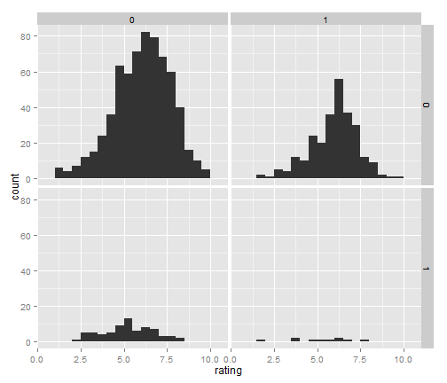 


```r
# More complex
m <- ggplot(movies, aes(x = rating))
m + geom_histogram()
```

```
## stat_bin: binwidth defaulted to range/30. Use 'binwidth = x' to adjust this.
```

```
## Warning: position_stack requires constant width: output may be incorrect
```

 

```r
m + geom_histogram(aes(y = ..density..)) + geom_density()
```

```
## stat_bin: binwidth defaulted to range/30. Use 'binwidth = x' to adjust this.
```

```
## Warning: position_stack requires constant width: output may be incorrect
```

 


```r
m + geom_histogram(binwidth = 1)
```

 

```r
m + geom_histogram(binwidth = 0.5)
```

 

```r
m + geom_histogram(binwidth = 0.1)
```

```
## Warning: position_stack requires constant width: output may be incorrect
```

 


```r
# Add aesthetic mappings
m + geom_histogram(aes(weight = votes))
```

```
## stat_bin: binwidth defaulted to range/30. Use 'binwidth = x' to adjust this.
```

```
## Warning: position_stack requires constant width: output may be incorrect
```

 

```r
m + geom_histogram(aes(y = ..count..))
```

```
## stat_bin: binwidth defaulted to range/30. Use 'binwidth = x' to adjust this.
```

```
## Warning: position_stack requires constant width: output may be incorrect
```

 

```r
m + geom_histogram(aes(fill = ..count..))
```

```
## stat_bin: binwidth defaulted to range/30. Use 'binwidth = x' to adjust this.
```

```
## Warning: position_stack requires constant width: output may be incorrect
```

 


```r
# Change scales
m + geom_histogram(aes(fill = ..count..)) + scale_fill_gradient("Count", low = "green", 
    high = "red")
```

```
## stat_bin: binwidth defaulted to range/30. Use 'binwidth = x' to adjust this.
```

```
## Warning: position_stack requires constant width: output may be incorrect
```

 

Often we don't want the height of the bar to represent the
count of observations, but the sum of some other variable.
For example, the following plot shows the number of movies
in each rating.

```r

qplot(rating, data = movies, geom = "bar", binwidth = 0.1)
```

```
## Warning: position_stack requires constant width: output may be incorrect
```

 

If, however, we want to see the number of votes cast in each
category, we need to weight by the votes variable

```r
qplot(rating, data = movies, geom = "bar", binwidth = 0.1, weight = votes, ylab = "votes")
```

```
## Warning: position_stack requires constant width: output may be incorrect
```

 


```r
m <- ggplot(movies, aes(x = votes))
```

### Transformed Scales
For transformed scales, binwidth applies to the transformed data.
The bins have constant width on the transformed scale.

```r
m + geom_histogram() + scale_x_log10()
```

```
## stat_bin: binwidth defaulted to range/30. Use 'binwidth = x' to adjust this.
```

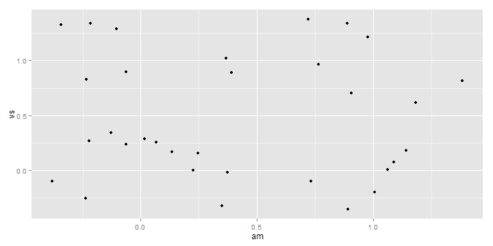 

```r
m + geom_histogram(binwidth = 1) + scale_x_log10()
```

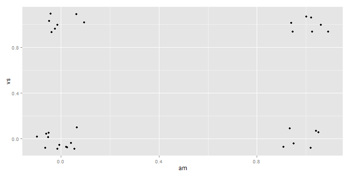 

```r
m + geom_histogram() + scale_x_sqrt()
```

```
## stat_bin: binwidth defaulted to range/30. Use 'binwidth = x' to adjust this.
```

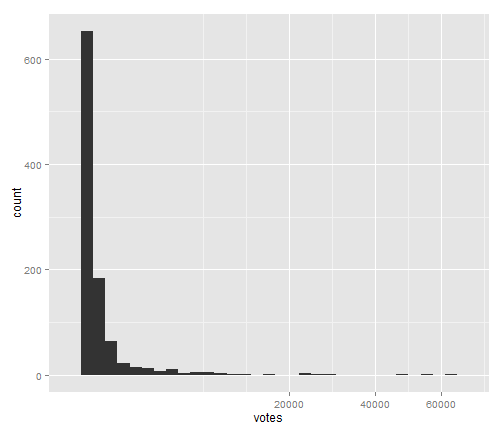 

```r
m + geom_histogram(binwidth = 10) + scale_x_sqrt()
```

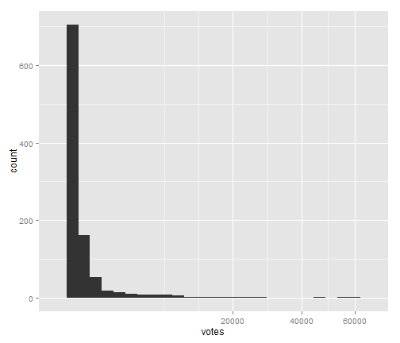 


```r
# For transformed coordinate systems, the binwidth applies to the raw data.
# The bins have constant width on the original scale.

# Using log scales does not work here, because the first bar is anchored at
# zero, and so when transformed becomes negative infinity.  This is not a
# problem when transforming the scales, because no observations have 0
# ratings.
```


```r
m + geom_histogram(origin = 0) + coord_trans(x = "log10")
```

```
## stat_bin: binwidth defaulted to range/30. Use 'binwidth = x' to adjust this.
```

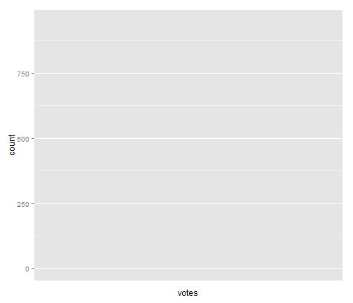 

```r
# Use origin = 0, to make sure we don't take sqrt of negative values
m + geom_histogram(origin = 0) + coord_trans(x = "sqrt")
```

```
## stat_bin: binwidth defaulted to range/30. Use 'binwidth = x' to adjust this.
```

 

```r
m + geom_histogram(origin = 0, binwidth = 1000) + coord_trans(x = "sqrt")
```

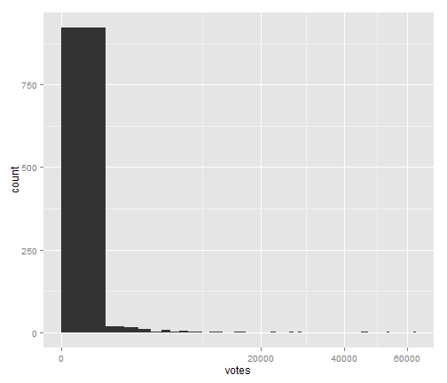 

### Transforming the y axis.
You can also transform the y axis.  Remember that the base of the bars
has value 0, so log transformations are not appropriate

```r

m <- ggplot(movies, aes(x = rating))
m + geom_histogram(binwidth = 0.5) + scale_y_sqrt()
```

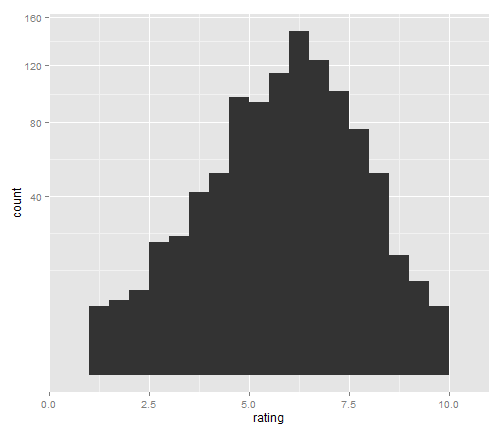 

```r
m + geom_histogram(binwidth = 0.5) + scale_y_reverse()
```

```
## Warning: Stacking not well defined when ymin != 0
```

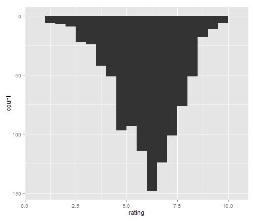 

### Setting aesthetics to fixed value

```r

m + geom_histogram(colour = "darkgreen", fill = "white", binwidth = 0.5)
```

 


```r
# Use facets
m <- m + geom_histogram(binwidth = 0.5)
m + facet_grid(Action ~ Comedy)
```

 


```r
# Often more useful to use density on the y axis when facetting
m <- m + aes(y = ..density..)
m + facet_grid(Action ~ Comedy)
```

 

```r
m + facet_wrap(~mpaa)
```

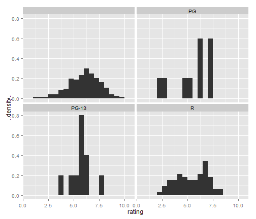 


```r
# Multiple histograms on the same graph see ?position, ?position_fill, etc
# for more details.
set.seed(6298)
diamonds_small <- diamonds[sample(nrow(diamonds), 1000), ]
ggplot(diamonds_small, aes(x = price)) + geom_bar()
```

```
## stat_bin: binwidth defaulted to range/30. Use 'binwidth = x' to adjust this.
```

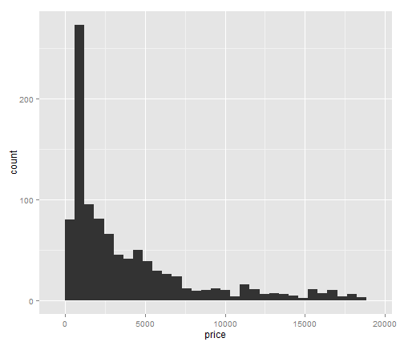 

```r
hist_cut <- ggplot(diamonds_small, aes(x = price, fill = cut))
hist_cut + geom_bar()  # defaults to stacking
```

```
## stat_bin: binwidth defaulted to range/30. Use 'binwidth = x' to adjust this.
```

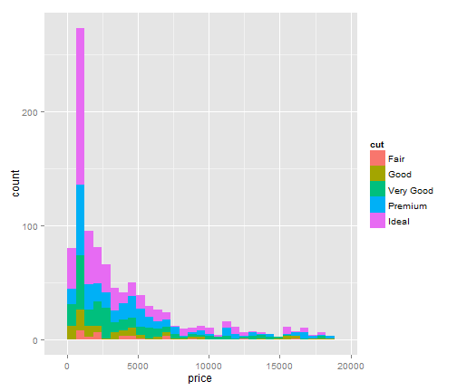 

```r
hist_cut + geom_bar(position = "fill")
```

```
## stat_bin: binwidth defaulted to range/30. Use 'binwidth = x' to adjust this.
```

 

```r
hist_cut + geom_bar(position = "dodge")
```

```
## stat_bin: binwidth defaulted to range/30. Use 'binwidth = x' to adjust this.
```

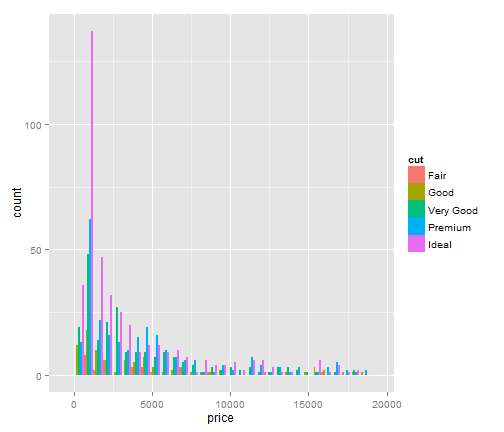 


```r
# This is easy in ggplot2, but not visually effective.  It's better to use a
# frequency polygon or density plot.  Like this:
ggplot(diamonds_small, aes(price, ..density.., colour = cut)) + geom_freqpoly(binwidth = 1000)
```

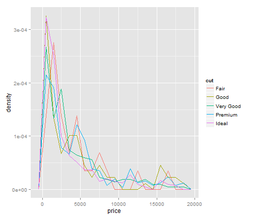 

```r
# Or this:
ggplot(diamonds_small, aes(price, colour = cut)) + geom_density()
```

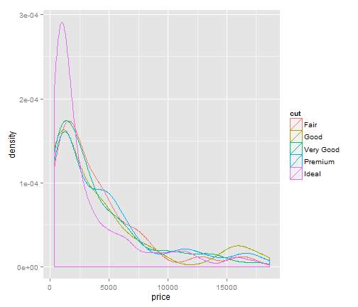 

```r
# Or if you want to be fancy, maybe even this:
ggplot(diamonds_small, aes(price, fill = cut)) + geom_density(alpha = 0.2)
```

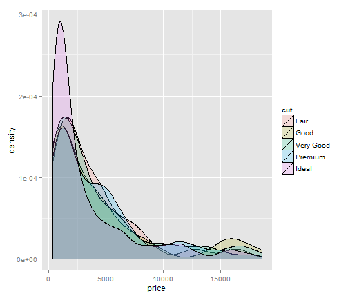 

```r
# Which looks better when the distributions are more distinct
ggplot(diamonds_small, aes(depth, fill = cut)) + geom_density(alpha = 0.2) + 
    xlim(55, 70)
```

```
## Warning: Removed 2 rows containing non-finite values (stat_density).
```

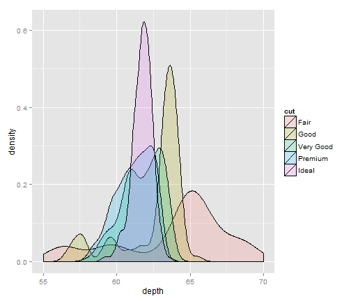 


