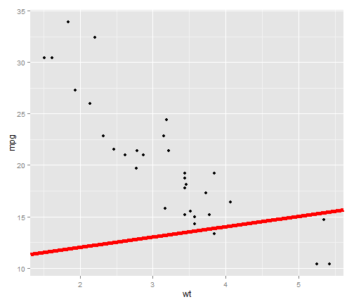
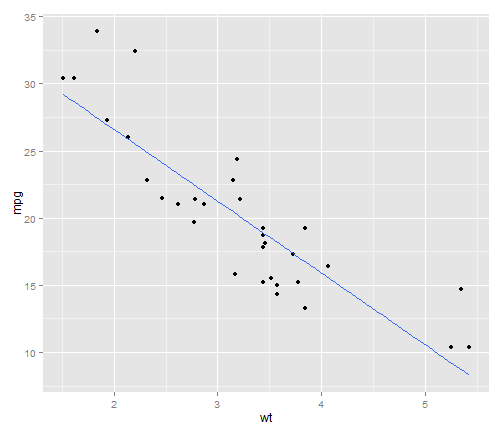
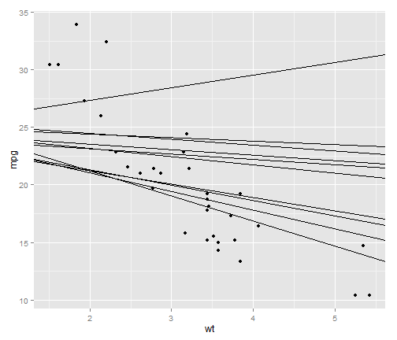
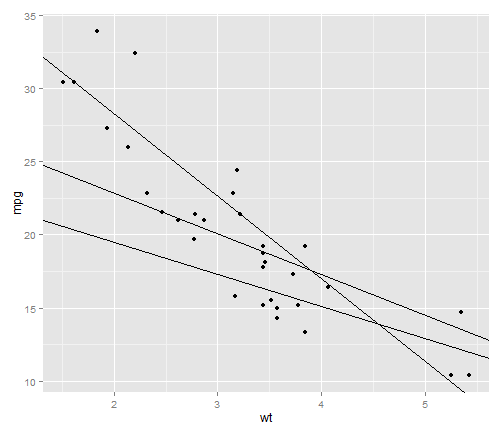
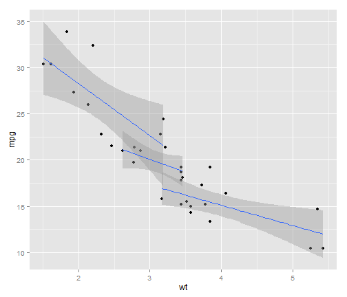
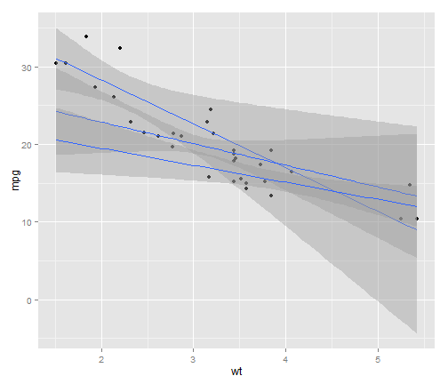
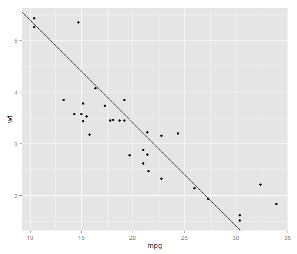
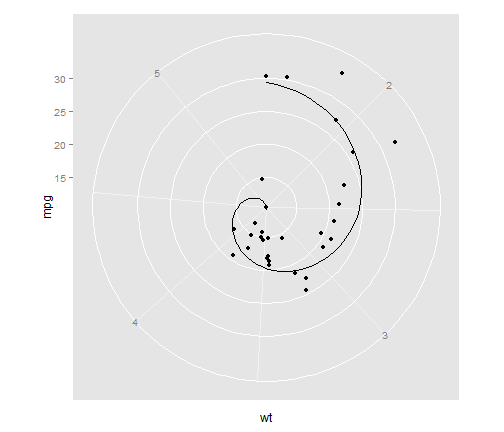

`geom_rect`
========================================================


```r
library(ggplot2)
```


### `geom_rect`


```r
set.seed(1234)
df <- data.frame(x = sample(10, 20, replace = TRUE), y = sample(10, 20, replace = TRUE))
head(df)
```

```
##   x y
## 1 2 4
## 2 7 4
## 3 7 2
## 4 7 1
## 5 9 3
## 6 7 9
```

```r
p <- ggplot(df, aes(xmin = x, xmax = x + 1, ymin = y, ymax = y + 2))

p + geom_rect()
```

 

```r
p + geom_rect(alpha = 0.5)
```

 

```r
p + geom_rect(alpha = 0.25)
```

 


<hr>

### `geom_abline`

```r
p <- qplot(wt, mpg, data = mtcars)

# Fixed slopes and intercepts
p + geom_abline()  # Can't see it - outside the range of the data
```

 

```r
p + geom_abline(intercept = 20)
```

 

```r

# Calculate slope and intercept of line of best fit
coef(lm(mpg ~ wt, data = mtcars))
```

```
## (Intercept)          wt 
##      37.285      -5.344
```

```r
p + geom_abline(intercept = 37, slope = -5)
```

 

```r
p + geom_abline(intercept = 10, colour = "red", size = 2)
```

 

```r

# See ?stat_smooth for fitting smooth models to data
p + stat_smooth(method = "lm", se = FALSE)
```

 

```r

# Slopes and intercepts as data
p <- ggplot(mtcars, aes(x = wt, y = mpg), . ~ cyl) + geom_point()
df <- data.frame(a = rnorm(10, 25), b = rnorm(10, 0))
p + geom_abline(aes(intercept = a, slope = b), data = df)
```

 

```r

# Slopes and intercepts from linear model
library(plyr)
coefs <- ddply(mtcars, .(cyl), function(df) {
    m <- lm(mpg ~ wt, data = df)
    data.frame(a = coef(m)[1], b = coef(m)[2])
})
str(coefs)
```

```
## 'data.frame':	3 obs. of  3 variables:
##  $ cyl: num  4 6 8
##  $ a  : num  39.6 28.4 23.9
##  $ b  : num  -5.65 -2.78 -2.19
```

```r
p + geom_abline(data = coefs, aes(intercept = a, slope = b))
```

 

```r

# It's actually a bit easier to do this with stat_smooth
p + geom_smooth(aes(group = cyl), method = "lm")
```

 

```r
p + geom_smooth(aes(group = cyl), method = "lm", fullrange = TRUE)
```

 

```r

# With coordinate transforms
p + geom_abline(intercept = 37, slope = -5) + coord_flip()
```

 

```r
p + geom_abline(intercept = 37, slope = -5) + coord_polar()
```

 

