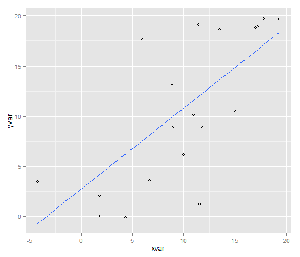

ggplot2 Regression
========================================================

Basic scatterplots with regression lines

#### preliminary


```r
library(ggplot2)
set.seed(955)
# Make some noisily increasing data
dat <- data.frame(cond = rep(c("A", "B"), each = 10), xvar = 1:20 + rnorm(20, 
    sd = 3), yvar = 1:20 + rnorm(20, sd = 3))
head(dat)
```

```
##   cond   xvar     yvar
## 1    A -4.252  3.47316
## 2    A  1.702  0.00594
## 3    A  4.323 -0.09425
## 4    A  1.781  2.07281
## 5    A 11.537  1.21544
## 6    A  6.672  3.60811
```

#### Part 1 Basic Plot

```r

ggplot(dat, aes(x = xvar, y = yvar)) + geom_point(shape = 1)  # Use hollow circles
```

 

#### Part 2 Add Regression Line

```r
ggplot(dat, aes(x=xvar, y=yvar)) +
    geom_point(shape=1) +    # Use hollow circles
    geom_smooth(method=lm,alpha=0.90)   # Add linear regression line 
```

 

```r
                             
```

#### Part 3 Regression Line

```r
ggplot(dat, aes(x=xvar, y=yvar)) +
    geom_point(shape=1) +    # Use hollow circles
    geom_smooth(method=lm,   # Add linear regression line
                se=FALSE)    # Don't add shaded confidence region
```

 

#### Part 4 
Add a loess smoothed fit curve with confidence region

```r
ggplot(dat, aes(x=xvar, y=yvar)) +
    geom_point(shape=1) +    # Use hollow circles
    geom_smooth()            # 
```

```
## geom_smooth: method="auto" and size of largest group is <1000, so using loess. Use 'method = x' to change the smoothing method.
```

 


